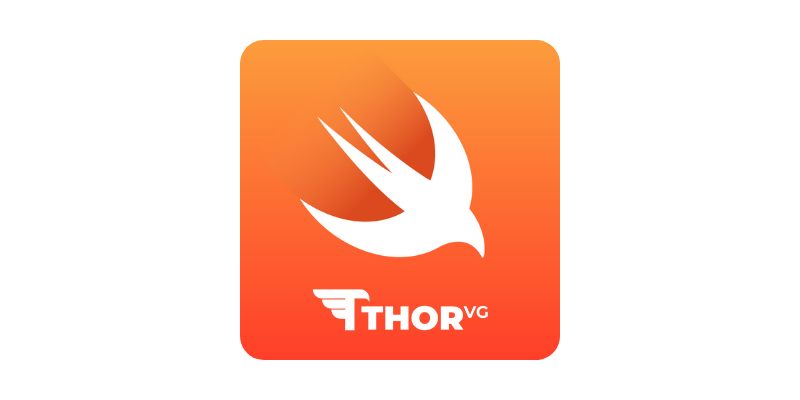

[](https://discord.gg/n25xj6J6HM)
[](https://chat.openai.com/g/g-Ht3dYIwLO-thorvgpt)
[](https://opencollective.com/thorvg)
[](LICENSE)

# ThorVG for Swift
<p align="center">  </p>

ThorVG for Swift is a lightweight wrapper around the [ThorVG C++ API](https://github.com/thorvg/thorvg), providing native support for vector graphics in Swift applications. This package currently only supports rendering Lottie animations and is actively evolving to include more features.

**ThorVG Version:** `v0.14.7` (commit `e3a6bf`)   
**Supported Platforms:** iOS 13.0+, macOS 10.15+

## Contents
- [Installation](#installation)
- [Usage](#usage)
  - [Low-Level API (Direct Rendering)](#low-level-api-direct-rendering)
  - [High-Level Views API (SwiftUI & UIKit)](#high-level-views-api-swiftui--uikit)
- [Build](#build)
- [Contributing](#contributing)

## Installation
To integrate `ThorVGSwift` into your Swift project, use Swift Package Manager. Simply add the following line to the dependencies section of your `Package.swift` file:

```swift
dependencies: [
  // ...
  .package(url: "https://github.com/thorvg/thorvg.swift", from: "0.1.0")
]
```

## Usage
This Swift wrapper currently only supports rendering Lottie animations. As the package evolves, additional support for more content types will be added.

ThorVGSwift provides two levels of API:
1. **Low-Level API**: Direct access to the rendering engine for frame-by-frame control
2. **High-Level Views API**: Ready-to-use SwiftUI and UIKit views with playback controls

### Low-Level API (Direct Rendering)

The low-level API closely follows the structure of the original ThorVG API, enabling rendering of Lottie frames to a buffer. This is useful when you need fine-grained control over frame rendering.

To start, create a `Lottie` instance using a desired local file path.

```swift
let url = Bundle.main.url(forResource: "test", withExtension: "json")
let lottie = try Lottie(path: url.path)
```

If you only have the string data of the Lottie, you can use the alternate `String` initialiser.

```swift
let lottie = try Lottie(string: "...")
```

Next, initialise a buffer for ThorVG to draw Lottie frame data into.

```swift
let size = CGSize(width: 1024, height: 1024)
let buffer = [UInt32](repeating: 0, count: Int(size.width * size.height))
```

From here, initialise a `LottieRenderer` instance to handle the rendering of individual Lottie frames.

```swift
let renderer = LottieRenderer(
    lottie,
    size: size,
    buffer: &buffer,
    stride: Int(size.width),
    pixelFormat: .argb
)
```

> [!NOTE]
> You can use different pixel formats including `.argb`, `.rgba`, etc. (see the complete list [here](/swift/PixelFormat.swift)).

By default, the `LottieRenderer` runs on the main thread. If needed, you can create a custom `Engine` with multiple threads.

```swift
let engine = Engine(numberOfThreads: 4)
let renderer = LottieRenderer(
    lottie,
    engine: engine,
    size: size,
    buffer: &buffer,
    stride: Int(size.width),
    pixelFormat: .argb
)
```

Once your `LottieRenderer` is set up, you can start rendering Lottie frames using the `render` function.

The `render` function takes three parameters:
- `frameIndex`: the index of the frame to render
- `contentRect`: the area of the Lottie content to render
- `rotation` (optional): the rotation angle to apply to the renderered frame

```swift
let contentRect = CGRect(x: 0, y: 0, width: size.width, height: size.height)
try renderer.render(frameIndex: 0, contentRect: contentRect, rotation: 0.0)
```

And voilà! Your buffer is now filled with the rendered Lottie frame data.

> [!TIP]
> To render all of the frames in a `Lottie` animation, you can iterate through the `numberOfFrames` property of the `Lottie` class.

### High-Level Views API (SwiftUI & UIKit)

For most use cases, ThorVGSwift provides convenient view components that handle rendering, playback, and animation lifecycle automatically. **All animation state is managed through the `LottieViewModel`**, which you create externally and pass to the view.

#### SwiftUI

```swift
import SwiftUI
import ThorVGSwift

struct ContentView: View {
    @StateObject private var viewModel: LottieViewModel
    
    init() {
        let lottie = try! Lottie(path: "animation.json")
        let config = LottieConfiguration(loopMode: .loop, speed: 1.0)
        
        // Size is optional - defaults to animation's intrinsic size
        _viewModel = StateObject(wrappedValue: LottieViewModel(
            lottie: lottie,
            configuration: config
        ))
    }
    
    var body: some View {
        LottieView(viewModel: viewModel)
            .onAppear { viewModel.play() }
            .onChange(of: viewModel.error) { _, error in
                if let error = error {
                    print("Animation error: \(error)")
                }
            }
    }
}
```

#### UIKit

```swift
import UIKit
import ThorVGSwift

class ViewController: UIViewController {
    private var viewModel: LottieViewModel!
    private var lottieView: LottieUIKitView!
    
    override func viewDidLoad() {
        super.viewDidLoad()
        
        let lottie = try! Lottie(path: "animation.json")
        let config = LottieConfiguration(loopMode: .loop, speed: 1.0)
        
        // Size is optional - defaults to animation's intrinsic size
        viewModel = LottieViewModel(
            lottie: lottie,
            configuration: config
        )
        lottieView = LottieUIKitView(viewModel: viewModel)
        
        // Observe animation errors
        lottieView.onError = { error in
            print("Animation error: \(error)")
        }
        
        view.addSubview(lottieView)
        // Add constraints...
        
        viewModel.play()
    }
}
```

#### Features

The high-level Views API provides:
- ✅ **ViewModel-Based State**: All animation state managed through `LottieViewModel`
- ✅ **Flexible Sizing**: Optional `size` parameter - defaults to animation's intrinsic dimensions
- ✅ **Playback Control**: Loop modes (playOnce, loop, repeat, autoReverse) and speed adjustment
- ✅ **Content Modes**: Aspect fit and aspect fill scaling options
- ✅ **Progress Tracking**: Monitor playback progress and state via published properties
- ✅ **Error Handling**: Built-in error reporting through Combine publishers
- ✅ **Manual Controls**: Play, pause, stop, and seek to specific frames or progress
- ✅ **Performance Optimized**: Reusable CGContext and efficient buffer management
- ✅ **Sample App**: Interactive iOS app demonstrating all features

> **Note:** Try the **[ThorVGSampleApp](ThorVGSampleApp/)** - a standalone iOS app with all examples! Just open `ThorVGSampleApp/ThorVGSampleApp.xcodeproj` and run. [Learn more →](ThorVGSampleApp/README.md)

📖 **[View Complete Views API Documentation →](docs/VIEWS_API_DOCUMENTATION.md)**

The full documentation includes:
- Detailed API reference for `LottieView`, `LottieUIKitView`, and `LottieViewModel`
- Configuration options and best practices
- Complete usage examples and integration patterns
- Testing strategies and troubleshooting guides

## Build

### For Package Users
Simply add the package dependency to your `Package.swift` - releases include pre-built XCFramework binaries and require no additional build steps.

```swift
dependencies: [
  .package(url: "https://github.com/thorvg/thorvg.swift", from: "0.1.0")
]
```

### For Local Development & Contributors

Contributors need to build the XCFramework locally, as it's not included in the repository (only in release tags).

#### Prerequisites
- Xcode with command-line tools installed
- Meson and Ninja build tools:
  ```bash
  brew install meson ninja
  ```

#### Building the XCFramework
Before building the Swift package, generate the ThorVG XCFramework:

```bash
# Clone with submodules
git clone --recursive https://github.com/thorvg/thorvg.swift
cd thorvg.swift

# Build the XCFramework (required for local development)
./scripts/build_frameworks.sh
```

The build script will:
1. Automatically detect your Xcode installation and SDK paths
2. Build ThorVG for macOS (arm64 + x86_64), iOS (arm64), and iOS Simulator (arm64)
3. Create `ThorVG.xcframework` containing all platform binaries
4. Generate a standalone macOS library in `lib/` for local development

Build outputs:
- **`ThorVG.xcframework/`** - Multi-platform framework (gitignored, only in releases)
- **`lib/libthorvg.a`** - Standalone macOS library (gitignored)

#### Building the Swift Package
Once the XCFramework is built, you can build and test the Swift package:

```bash
swift build    # Build the package
swift test     # Run tests
```

#### Creating a Release

Maintainers can create releases with pre-built binaries:

```bash
# This builds the XCFramework and creates a release commit + tag
./scripts/release.sh 0.1.0
```

See [docs/CONTRIBUTING.md](docs/CONTRIBUTING.md#creating-a-release) for complete release instructions and [docs/RELEASE_POLICY.md](docs/RELEASE_POLICY.md) for the full release policy.

> [!NOTE]
> The build script uses ThorVG's native Meson build system instead of Swift Package Manager compiling C++ directly.
> This approach simplifies maintenance and ensures consistent builds across platforms.

> [!TIP]
> If you're on an Intel Mac and want x86_64 simulator support, you can modify `scripts/build_frameworks.sh` to include both architectures for the simulator. By default, only arm64 is built for simulator (Intel Macs can use it via Rosetta 2).

## Contributing

Contributions are welcome! See [docs/CONTRIBUTING.md](docs/CONTRIBUTING.md) for:
- Quick start guide
- How to build from source
- Making changes to Swift code
- Updating the XCFramework
- What to commit

### Additional Documentation

- [Build System](docs/BUILD_SYSTEM.md) - Comprehensive guide to how ThorVGSwift builds and packages ThorVG, including cross-compilation details, build options, and troubleshooting
- [Release Policy](docs/RELEASE_POLICY.md) - Versioning, release cadence, and procedures for maintainers
- [Changelog](docs/CHANGELOG.md) - History of changes and releases

Feel free to open an issue or submit a pull request!
